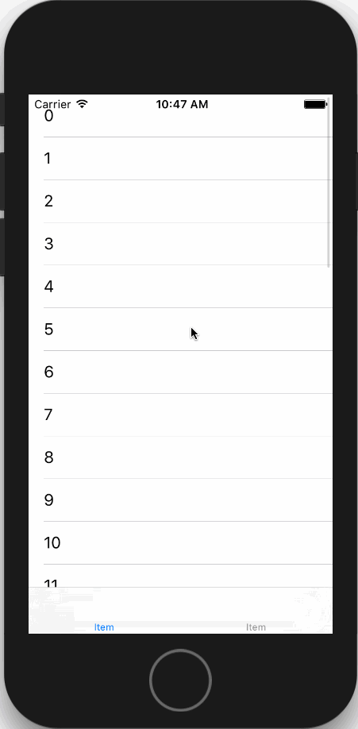

# NavigationBarTranslucent

[]()
[]()
[]()
[]()

导航栏透明效果

## 特性

- 通过Category，代码无侵入性
- 每个控制器可指定自己的导航栏透明度
- 取消当UINavigationBar.isTranslucent==YES时系统自动给导航栏添加的半透明效果，还原自定义的导航栏颜色

## 环境要求

- Xcode9.0+
- iOS9.0+

## 演示

[]()

## 用法

- 将`NavigationBarTranslucent`文件夹拖入你的项目中

- 示例代码
	1. 导入头文件
	```ObjC
	#import "XPNavigationBarTranslucent.h"
	```
	2. 设置透明度
	```ObjC
	// translucent必须为YES,导航栏才能实现透明效果
	self.navigationController.navigationBar.translucent = YES;
	// 导航栏透明度
	[self setNavigationBarAlpha:0.0];
	```
	3. 实现UIScrollViewDelegate方法，随着视图的滑动不断修改导航栏透明度
	```ObjC
	- (void)scrollViewDidScroll:(UIScrollView *)scrollView {
		CGFloat maxOffset = 100.0;
		CGFloat verticalOffset = MIN(MAX(scrollView.contentOffset.y, 0.0), maxOffset);
		CGFloat alpha = verticalOffset / maxOffset;
		[self setNavigationBarAlpha:alpha];
	}
	```

## 致谢

- [ETNavBarTransparent](https://github.com/EnderTan/ETNavBarTransparent.git)

感谢他们对开源社区做出的贡献。

## 协议

许可在 MIT 协议下使用，查阅`LICENSE`文件来获得更多信息。
